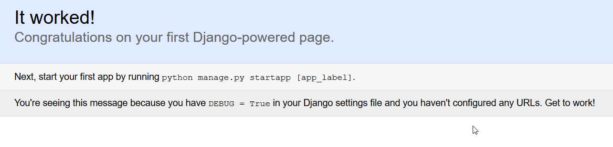

# Django Starter

I assume you're working in Command Prompt on a windows machine. **$** indicates the prompt path.

It's a good practice to create a virtual environment before you work on your project. 

#### 1. Install Virtualenv
```
$ pip install virtualenv
```

#### 2. Create a virutalenv instance
```
$ virtualenv your_environment_name
```

#### 3. Activate the environment
```
$ cd your_environment_name/

dir_path\your_environment_name> $ Scripts\activate
```

#### 4. Install Django 1.11 in the Virtual Environment
```
(your_environment_name) $ pip install django==1.11
```

#### 5. Start a Django Project
```
(your_environment_name) $ django-admin startproject your_project_name
```

#### 6. Navigate to project folder
```
(your_environment_name) $ cd your_project_name
(your_environment_name) $ dir
|-- manage.py
|-- myproject/
      |-- settings.py
      |-- urls.py
      |-- wsgi.py
      |-- __init__.py
 ```

#### 7. Freeze requirements.txt to keep track of dependencies
```
(your_environment_name) $ pip freeze >requirements.txt
(your_environment_name) $ dir
|-- manage.py
|-- myproject/
|-- requirements.txt

(your_environment_name) $ more requirements.txt
Django==1.11
pytz==2018.3
```
When you pip freeze to a requirements.txt file, pip saves all the dependencies in the file which can be used to later to install dependencies on the server.

#### 8. Create a Database instance (empty)
```terminal
(your_environment_name) your_project_name/ $ python manage.py makemigrations
No changes detected


(your_environment_name) your_project_name/ $ python manage.py migrate
Operations to perform:
  Apply all migrations: admin, auth, contenttypes, sessions
Running migrations:
  Applying contenttypes.0001_initial... OK
  Applying auth.0001_initial... OK
  Applying admin.0001_initial... OK
  Applying admin.0002_logentry_remove_auto_add... OK
  Applying contenttypes.0002_remove_content_type_name... OK
  Applying auth.0002_alter_permission_name_max_length... OK
  Applying auth.0003_alter_user_email_max_length... OK
  Applying auth.0004_alter_user_username_opts... OK
  Applying auth.0005_alter_user_last_login_null... OK
  Applying auth.0006_require_contenttypes_0002... OK
  Applying auth.0007_alter_validators_add_error_messages... OK
  Applying auth.0008_alter_user_username_max_length... OK
  Applying sessions.0001_initial... OK
```

#### 9. Create a superuser -- admin for your project to access all project data.
```
(your_environment_name) your_project_name/ $ python manage.py createsuperuser

Username (leave blank to use 'vd'): admin
Email address: <youremail>
Password:
Password (again):
Superuser created successfully.
```
Password will not be shown as you type on the screen, not even * to indicate the characters. So please note that you have keep track of your characters as you type. It's just invisible.

#### 10. Run the server
```
(your_environment_name) your_project_name/ $ python manage.py runserver

Performing system checks...

System check identified no issues (0 silenced).
March 03, 2018 - 15:53:04
Django version 1.11, using settings 'myproject.settings'
Starting development server at http://127.0.0.1:8000/
Quit the server with CTRL-BREAK.

```
You'll be able to access the default site at **localhost:8000** or **127.0.0.1:8000**

